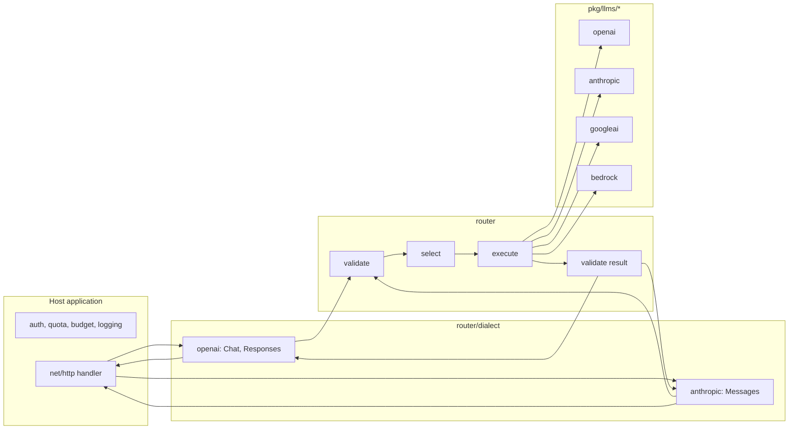

# Semantic router

## 1. Purpose, scope and decisions

### 1.1 Purpose

`router` is an embeddable Go library that performs **one** non-streaming text
inference against a registered model deployment. It validates a portable request,
selects an eligible target (exactly by name, or through a caller-supplied semantic
selector), runs the target's connector, validates the result and returns it with
normalized usage. Dialect codecs translate between public API shapes (OpenAI Chat
Completions, OpenAI Responses, Anthropic Messages) and the portable contract.

The router does not execute tools, persist conversations, stream, or serve HTTP.
The host application owns transport, authentication, API keys, quotas, budgets,
logging and status codes; the router exposes typed error kinds and the codecs map
them to each dialect's status and envelope.

### 1.2 Non-goals for this release

Streaming, stored/stateful Responses, images, audio, files, batches, embeddings,
model listing, token counting, built-in provider tools, automatic cross-provider
retry. See section 8 for the roadmap.

### 1.3 Decisions

| ID  | Decision                                                                                                                                                                                                                                                                                                           |
| --- | ------------------------------------------------------------------------------------------------------------------------------------------------------------------------------------------------------------------------------------------------------------------------------------------------------------------ |
| D1  | Three ingress dialects: OpenAI Chat Completions, OpenAI Responses, **Anthropic Messages**. Each is a pure codec (bytes ↔ portable types); none is an HTTP handler.                                                                                                                                                 |
| D2  | Non-streaming only. `stream:true` is rejected before selection.                                                                                                                                                                                                                                                    |
| D3  | Stateless. Clients send complete history. `store` defaults to false and `store:true`, `previous_response_id`, `conversation`, `background`, item references are rejected.                                                                                                                                          |
| D4  | A configured selector runs on every valid request and may override the requested model. Without a selector, the requested model must resolve exactly.                                                                                                                                                              |
| D5  | Selection fails closed. Only an explicitly configured fallback (`requested` or a target ID) may recover a selector failure, and it is revalidated.                                                                                                                                                                 |
| D6  | Support is certified per configured target, not per provider family.                                                                                                                                                                                                                                               |
| D7  | **Reasoning is first-class.** Connectors return reasoning blocks (summary text plus opaque provider state) to the application in the Go result. Opaque state is replayed verbatim to the target that produced it and rejected for any other target. Codecs can omit reasoning from the public response on request. |
| D8  | **Ingress strictness is configurable.** Lenient (default): unknown fields ignored, `null` means omitted, known fields with non-default unsupported values are rejected by name. Strict: unknown fields, duplicate keys and nulls are rejected.                                                                     |
| D9  | **Admission control is injectable**, not built in. `Config.Admission` is an optional interface; nil means none. A concurrency limiter is provided as a convenience implementation.                                                                                                                                 |
| D10 | **OpenAI upstream prefers the Responses API.** Chat Completions upstream is a per-connector compatibility option and the default for OpenAI-compatible third parties.                                                                                                                                              |
| D11 | Portable types are typed enums, not bare strings. The block model carries an extension slot for opaque state now so that media can be added without a breaking change.                                                                                                                                             |

## 2. Architecture



| Package                                        | Responsibility                                                                                                                                                            | Depends on               |
| ---------------------------------------------- | ------------------------------------------------------------------------------------------------------------------------------------------------------------------------- | ------------------------ |
| `pkg/llms`                                     | Portable inference contract: `InferenceModel`, request/response/block types, typed enums, `Clone`.                                                                        | nothing new              |
| `pkg/llms/{openai,anthropic,googleai,bedrock}` | `ValidateInference` + `Infer`: translate portable ↔ provider wire, one attempt, typed failures. Never import `router`.                                                    | SDKs                     |
| `pkg/llmfactory`                               | `ExactResolver` / `ResolveExact`: construct one configured provider/model without fallback.                                                                               | `pkg/llms`               |
| `router`                                       | Catalog, `Selector`, `Admission`, request/history validation, execution, result validation, typed `Error`, `Observation`. `Connector(llms.Model)` adapts a factory model. | `pkg/llms`, `pkg/schema` |
| `router/dialect`                               | Shared codec helpers: options, lenient/strict JSON, opaque-state envelope, error kind → HTTP status.                                                                      | `router`                 |
| `router/dialect/openai`                        | `DecodeChat`, `EncodeChat`, `DecodeResponses`, `EncodeResponses`, `EncodeError`.                                                                                          | `router/dialect`         |
| `router/dialect/anthropic`                     | `DecodeMessages`, `EncodeMessages`, `EncodeError`.                                                                                                                        | `router/dialect`         |

A host handler is roughly: authenticate → read bounded body → `Decode*` →
`router.Generate` → `Encode*` or `EncodeError` → write. A compiling example lives
in `router/dialect/openai/example_test.go`; the library ships no `ServeHTTP`.

## 3. Portable contract (`pkg/llms/inference.go`)

```go
type InferenceModel interface {
    ValidateInference(InferenceRequest) error            // reject what cannot be translated faithfully
    Infer(context.Context, InferenceRequest) (*InferenceResponse, error) // one attempt, no tool execution
}

type InferenceRole  string // system, developer, user, assistant, tool
type BlockType      string // text, function_call, function_call_output, refusal, reasoning
type FinishReason   string // stop, length, tool_calls, content_filter
type FormatType     string // text, json_object, json_schema
type ToolChoiceMode string // auto, none, required, function
type Effort         string // minimal, low, medium, high

type InferenceRequest struct {
    Model             string
    Messages          []InferenceMessage
    Tools             []InferenceTool
    ToolChoice        *InferenceToolChoice // nil = provider default
    ParallelToolCalls *bool
    Temperature       *float64
    TopP              *float64
    MaxTokens         *int
    Stop              []string
    Seed              *int64
    Format            *InferenceFormat
    Reasoning         *InferenceReasoning  // nil = provider default
}
type InferenceMessage struct { Role InferenceRole; Content []InferenceBlock }
type InferenceBlock struct {
    Type      BlockType
    Text      string          // text, refusal, function output, reasoning summary
    ID        string          // function call ID (function_call / function_call_output)
    Name      string          // function name
    Arguments string          // raw JSON object bytes, never re-encoded
    Opaque    json.RawMessage // reasoning only: provider state, replayed verbatim
    Source    string          // reasoning only: router target ID that produced Opaque
}
type InferenceToolChoice struct { Mode ToolChoiceMode; Name string }
type InferenceTool struct { Name, Description string; Parameters json.RawMessage; Strict *bool }
type InferenceFormat struct { Type FormatType; Name string; Schema json.RawMessage; Strict bool }
type InferenceReasoning struct { Effort Effort; BudgetTokens *int }
type InferenceResponse struct {
    Content      []InferenceBlock
    FinishReason FinishReason
    Usage        Usage
    UsageKnown   bool
    UpstreamID   string
}
```

Rules:

- Presence is meaning. A nil pointer is "not supplied"; connectors omit the wire
  field. Explicit zero survives translation.
- `Arguments`, `Parameters`, `Schema` and `Opaque` are raw JSON and are never
  decoded-then-re-encoded on the request path. Connectors that must hand the SDK a
  decoded value (Bedrock, GoogleAI) use `json.Number` and restore raw bytes.
- `InferenceRequest.Clone()` is an explicit deep copy. The router copies once per
  `Generate`; validators receive read-only views.
- Reasoning blocks are legal only in assistant messages (request) and in output
  (response). `Opaque` without `Source` is invalid in a request.
- `InferenceError{Status, Param, Cause}` carries the upstream HTTP status or 400
  for an unsupported parameter. It is the only error type connectors return for
  classified failures.

### 3.1 Connector obligations

| Concern       | Obligation                                                                                                                                                                                                                                                            |
| ------------- | --------------------------------------------------------------------------------------------------------------------------------------------------------------------------------------------------------------------------------------------------------------------- |
| Validation    | `ValidateInference` rejects with `UnsupportedInference(param)` every control the provider cannot express (not "may not support"). `Infer` calls it first.                                                                                                             |
| Roles         | `system`/`developer` map to the provider's instruction channel or are rejected. Consecutive same-role messages are merged by the connector when the provider requires it.                                                                                             |
| Tool results  | All results for one assistant turn are delivered in one provider turn where the provider requires it (GoogleAI, Bedrock).                                                                                                                                             |
| Finish reason | Mapped from the table in section 6. Unknown provider values are an upstream error.                                                                                                                                                                                    |
| Usage         | Normalized as in section 6. Never fabricated; `UsageKnown=false` when absent.                                                                                                                                                                                         |
| Retries       | Exactly one attempt. SDK retries disabled on this path only.                                                                                                                                                                                                          |
| Reasoning     | Returned as `reasoning` blocks with `Text` (summary, may be empty) and `Opaque` (state the provider needs back, may be empty). On request, `Opaque` is placed back where the provider expects it (section 5). `Source` is validated by the router, not the connector. |
| Errors        | `InferenceFailure(err, status, op)` with the SDK's status when known, else 502. Messages never reach clients; codecs emit sanitized text.                                                                                                                             |

## 4. Router core

```go
type Target struct {
    ID, BackendModel string
    Aliases          []string
    Connector        llms.InferenceModel
    Features         Features           // Tools, JSON, JSONSchema, StrictSchema, StrictTools, SchemaWithTools, DeveloperRole, Reasoning, Seed
    Tags             map[string]string  // bounded operator metadata surfaced to selectors (tier, cost class, region, ...)
    MaxOutputTokens  int
    Allow            func(context.Context) bool
}
type Candidate struct { ID string; Features Features; Tags map[string]string }
type Selector interface { Select(context.Context, SelectionInput) (Decision, error) }
type Admission interface { Admit(context.Context, AdmissionRequest) (release func(), err error) }
type Config struct {
    Targets []Target; Selector Selector; SelectorTimeout, Timeout time.Duration
    Admission Admission; Fallback string; MinimumConfidence float64
    Observe func(context.Context, Observation)
}
type Result struct { ID string; CreatedAt int64; Model, BackendModel, Classification string; Response llms.InferenceResponse }
type Kind string // invalid_request, unsupported, model_not_found, selection_unavailable, rate_limited, upstream_error, timeout, cancelled, internal_error
type Error struct { Kind Kind; Param, Message string; Cause error }
```

Execution order in `Generate`:

1. Admission (`Config.Admission`, if any). Rejection → `rate_limited` unless the
   implementation returns its own `*Error`.
2. Copy request once; validate shape, sizes, history and schemas (section 4.1).
3. Build eligible set: `Allow(ctx)`, `Features` all-of check, `MaxOutputTokens`,
   reasoning `Source` compatibility, then `Connector.ValidateInference`.
4. No selector: requested name must be eligible; otherwise the requested target's
   own rejection is returned (`unsupported`) or `model_not_found` (non-disclosing).
   Selector: one call with candidates and a read-only copy; validate decision
   (target, confidence, classification length); apply configured fallback only.
5. Set backend model and default output limit; run `Infer` with the remaining
   deadline. A completed response is returned even if the deadline expired during
   the last byte; only a failed call is reported as `timeout`/`cancelled`.
6. Validate result (section 4.2). Normalize rather than fail where the provider
   merely disagrees on bookkeeping.
7. Observe (with the caller's context, before cancellation) and return.

`Timeout` zero means no router-imposed deadline. `SelectorTimeout` defaults to 5s.

### 4.1 Request validation (hard failures, `invalid_request`)

Message count, block count, tool count, metadata bounds, sampling ranges, stop
strings, tool names (`[a-zA-Z_][a-zA-Z0-9_-]{0,63}`, reserved words excluded),
portable schema subset (`pkg/schema.ValidatePortableSchema`), tool-choice naming a
known tool, instruction messages first, every historical call resolved exactly
once before the next non-tool message, arguments are JSON objects, last message
not assistant (no prefill), reasoning blocks only in assistant messages and only
with `Source` when `Opaque` is present.

### 4.2 Result validation

| Condition                                                                    | Action                                            |
| ---------------------------------------------------------------------------- | ------------------------------------------------- |
| Unknown block type or unknown tool name in a call                            | `upstream_error`                                  |
| Duplicate call ID                                                            | `upstream_error`                                  |
| Call returned under `tool_choice: none` or a different named function        | `upstream_error`                                  |
| Arguments not a JSON object (finish ≠ length)                                | `upstream_error`                                  |
| Strict tool arguments violate schema                                         | `upstream_error`                                  |
| Completed JSON output invalid or violates schema (finish = stop, no refusal) | `upstream_error`                                  |
| Calls present but finish = stop                                              | **normalize** finish to `tool_calls`              |
| Empty content with finish = length or content_filter                         | **accept**                                        |
| Empty content with finish = stop / tool_calls                                | `upstream_error`                                  |
| Usage totals inconsistent or absurd                                          | **set `UsageKnown=false`**, record in observation |
| `required`/named choice, finish = stop, no calls, no refusal                 | `upstream_error`                                  |

## 5. Reasoning passthrough

Each connector maps its provider's reasoning representation to `reasoning` blocks:

| Provider         | Response → block                                                                                                                                                                           | Request ← block                                                                                    |
| ---------------- | ------------------------------------------------------------------------------------------------------------------------------------------------------------------------------------------ | -------------------------------------------------------------------------------------------------- |
| OpenAI Responses | Each `reasoning` output item → one block; `Text` = joined summary text; `Opaque` = the raw item JSON (includes `encrypted_content`, requested via `include`).                              | Item JSON from `Opaque` is placed back into `input` at its position.                               |
| OpenAI Chat      | No reasoning content available; `reasoning_effort` accepted.                                                                                                                               | Reasoning blocks dropped (Chat has no slot); documented.                                           |
| Anthropic        | `thinking` block → `Text` = thinking, `Opaque` = raw block (with `signature`); `redacted_thinking` → `Text` empty, `Opaque` = raw block.                                                   | Raw block replayed in the assistant content at its position.                                       |
| GoogleAI         | Part with `thought:true` → block with `Text`; any part carrying `thoughtSignature` → a reasoning block **immediately before** the derived block with `Opaque = {"thoughtSignature": ...}`. | The signature in a reasoning block is attached to the next non-reasoning part of the same message. |
| Bedrock Converse | `reasoningContent.reasoningText{text, signature}` / `redactedContent` → block with `Opaque` = raw content block.                                                                           | Raw block replayed at its position.                                                                |

Router rule: for every reasoning block in the request with non-empty `Opaque`,
`Source` must equal the selected target's ID; otherwise the target is ineligible
(`unsupported`, param `messages.reasoning`). When a selector reroutes a
continuation, this is what stops opaque state from reaching a foreign provider.
Applications that want cross-target continuations drop reasoning blocks.

Codec rule: on output, `Opaque` and `Source` are sealed into one string with
`dialect.SealOpaque(source, opaque)`; on input `dialect.OpenOpaque` restores
both. The seal is placed where each dialect has an opaque field:
Responses `reasoning.encrypted_content`, Anthropic `thinking.signature` /
`redacted_thinking.data`, Chat `reasoning_details[].data` (OpenRouter-compatible
shape). `EncodeOptions.OmitReasoning` removes reasoning from the public response
while the Go `Result` keeps it.

Reasoning controls: Chat `reasoning_effort`, Responses `reasoning.effort` and
`reasoning.summary`, Anthropic `thinking.budget_tokens` (and `thinking.type`)
map to `InferenceReasoning`. Connectors map `Effort` to a native effort when the
provider has one, otherwise to a budget (`minimal` 1024, `low` 2048, `medium`
8192, `high` 24576 tokens), and pass `BudgetTokens` through when given. A target
must declare `Features.Reasoning` to accept reasoning controls.

## 6. Normalization tables

Finish reasons:

| Portable       | OpenAI Chat / Responses                         | Anthropic                   | GoogleAI                                                  | Bedrock Converse                           |
| -------------- | ----------------------------------------------- | --------------------------- | --------------------------------------------------------- | ------------------------------------------ |
| stop           | `stop` / `completed`                            | `end_turn`, `stop_sequence` | `STOP`                                                    | `end_turn`, `stop_sequence`                |
| length         | `length` / `incomplete: max_output_tokens`      | `max_tokens`                | `MAX_TOKENS`                                              | `max_tokens`                               |
| tool_calls     | `tool_calls` (or any function_call item)        | `tool_use`                  | `STOP` with function calls                                | `tool_use`                                 |
| content_filter | `content_filter` / `incomplete: content_filter` | `refusal`                   | `SAFETY`, `RECITATION`, `PROHIBITED_CONTENT`, `BLOCKLIST` | `content_filtered`, `guardrail_intervened` |

Usage (all counts as `uint64`, `InputTokens` **includes** cache reads and writes):

| Provider  | Input                                 | CacheRead                 | CacheWrite                    | Output                                      | Reasoning            | Total                      |
| --------- | ------------------------------------- | ------------------------- | ----------------------------- | ------------------------------------------- | -------------------- | -------------------------- |
| OpenAI    | `prompt_tokens` / `input_tokens`      | `cached_tokens`           | n/a                           | `completion_tokens` / `output_tokens`       | `reasoning_tokens`   | provider total             |
| Anthropic | `input + cache_read + cache_creation` | `cache_read_input_tokens` | `cache_creation_input_tokens` | `output_tokens`                             | n/a                  | Input + Output             |
| GoogleAI  | `promptTokenCount`                    | `cachedContentTokenCount` | n/a                           | `candidatesTokenCount + thoughtsTokenCount` | `thoughtsTokenCount` | provider `totalTokenCount` |
| Bedrock   | `input + cacheRead + cacheWrite`      | `cacheReadInputTokens`    | `cacheWriteInputTokens`       | `outputTokens`                              | n/a                  | Input + Output             |

Codecs re-derive dialect-native shapes: Anthropic `input_tokens` on the wire is
`Input - CacheRead - CacheWrite`.

Error kind → HTTP status (`dialect.HTTPStatus`): invalid_request 400,
unsupported 400, model_not_found 404, rate_limited 429, selection_unavailable 503,
upstream_error 502, timeout 504, cancelled 499 (never written), internal_error 500.
Hosts may override.

## 7. Dialect codecs

Common behaviour (`dialect.DecodeOptions{Strict}`, `dialect.EncodeOptions{OmitReasoning}`):

- Lenient: unknown keys ignored at every level; `null` treated as omitted; known
  keys whose value is unsupported and **not** the provider default are rejected
  with `unsupported` naming the parameter (`n:2`, `stream:true`, `store:true`,
  `logprobs:true`, non-empty `logit_bias`, nonzero penalties, `top_k`, ...).
- Strict: additionally, unknown keys, duplicate keys and `null` (except where the
  dialect defines null, e.g. Chat assistant `content`) are `invalid_request`.
- Always: bounded nesting (32), well-formed JSON, no trailing data.
- `user` / `safety_identifier` / `metadata.user_id` are copied into
  `Request.Metadata["user"]`; `metadata` maps are copied within bounds.

### 7.1 OpenAI Chat Completions

Accepted: `model`, `messages` (system/developer/user/assistant/tool; string or
text parts; assistant `tool_calls`, `refusal`, `annotations`, `reasoning_details`
replay), `tools[].function`, `tool_choice`, `parallel_tool_calls`, `temperature`,
`top_p`, `max_tokens` xor `max_completion_tokens`, `stop`, `seed`,
`response_format`, `reasoning_effort`, `metadata`, `user`, defaults for
`n`/`stream`/`store`/`logprobs`/penalties/`modalities:["text"]`.
Output: `chat.completion` with one choice; reasoning as `reasoning_details`
unless omitted; `usage` omitted when unknown.

### 7.2 OpenAI Responses

Accepted: `model`, `input` (string or items: `message` with input_text /
output_text / refusal parts, `function_call`, `function_call_output`,
`reasoning` replay), `instructions`, `tools` (flat function), `tool_choice`,
`parallel_tool_calls`, `temperature`, `top_p`, `max_output_tokens`,
`text.format`, `reasoning{effort,summary}`, `include:["reasoning.encrypted_content"]`,
`metadata`, `user`, `store:false`, `stream:false`, `truncation:"disabled"`.
Rejected: `previous_response_id`, `conversation`, `background`, item references,
`store:true`, built-in tools. Output: `response` with ordered `output` items
(`reasoning`, `message`, `function_call`), `status`, `incomplete_details`,
`usage` null when unknown.

### 7.3 Anthropic Messages

Accepted: `model`, `max_tokens` (required by dialect), `system` (string or text
blocks), `messages` (user/assistant; string or blocks: `text`, `tool_use`,
`tool_result` with string or text-block content, `thinking`, `redacted_thinking`),
`tools` (custom tools only: `name`, `description`, `input_schema`, `strict`),
`tool_choice{type: auto|any|tool|none, name, disable_parallel_tool_use}`,
`temperature`, `top_p`, `stop_sequences`, `thinking{type, budget_tokens}`,
`output_config.format` (json_schema), `metadata.user_id`, `stream:false`.
Rejected: `top_k`, server tools, `mcp_servers`, `container`, non-text media,
`cache_control` in strict mode (ignored in lenient).
Output: `message` with `content` blocks (`thinking`, `text`, `tool_use`),
`stop_reason` (`end_turn`, `max_tokens`, `tool_use`, `stop_sequence` when a stop
string matched is not distinguishable → `end_turn`, `refusal`), `usage` with
Anthropic-native input accounting; unknown usage encodes zeros (dialect requires
the object). Error envelope `{"type":"error","error":{"type","message"}}`.

## 8. Acceptance and roadmap

Acceptance: fixture matrix of three ingress dialects × four connectors for text,
tool call, parallel tool continuation, JSON schema, schema + tools, reasoning
passthrough round trip, refusal, length truncation, usage absence; SDK-shaped
replays (OpenAI Python/Go assistant message with `refusal:null`, `annotations`,
Responses `output_text` with `logprobs`) decode in lenient mode; strict mode
rejects them; opaque state from target A is refused by target B; live smoke
against one deployment per family recorded with date, model and features.

| Stage       | Features                                                                                       | Prerequisites                                                                                       |
| ----------- | ---------------------------------------------------------------------------------------------- | --------------------------------------------------------------------------------------------------- |
| V1 (this)   | Three dialects, four connectors, tools, JSON, reasoning passthrough, selectors, admission hook | This document                                                                                       |
| Streaming   | SSE for all three dialects                                                                     | Typed event interface in `pkg/llms`, per-dialect serializers, cancellation and backpressure tests   |
| Selectors   | LLM / embedding classifier implementations, tag-based policies                                 | Labeled evaluation set, selector usage accounting (already in `Decision`)                           |
| Media input | Image (then file/audio) parts                                                                  | `InferenceBlock` gains `Media{MIME, Data/URL}`; `Features.Vision`; codec part mappings; size limits |
| Stateful    | Stored responses, `previous_response_id`, conversations                                        | Tenant-scoped store, retention, ID stability                                                        |
| Batches     | Submit/status/results                                                                          | Reuse `llms.Batcher`; durable job state                                                             |

Adding a provider requires: an `InferenceModel` implementation with the section 3.1
obligations, rows in the section 6 tables, and conformance fixtures. No change to
selection, validation or codecs.
